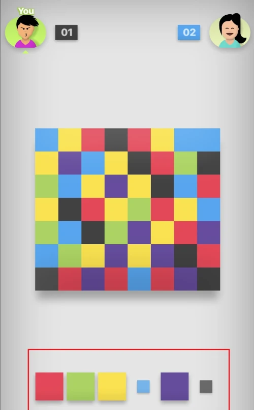

# Creating Filler (7 Colors) in Rust

I am currently in the process of learning the Rust programming language, and I've gotten the urge to write an algorithm that can play Filler well, possibly better than a human opponent. But before I can do that, I need to have a way to play Filler games in Rust, and from what I've found, there aren't any libraries which provide a way to simulate Filler games.

If you haven't played Filler before, it's a two player game which is played on a square grid of boxes. The boxes are randomly colored, usually out of 7 colors. Each player starts on an opposite corner of the box, and can change the color of your box to another color. When you do, you capture all neighboring boxes which have the same color you chose. You keep switching colors, and you keep capturing more boxes which neighbor your captured boxes, until you control more than 50% of the boxes on the board. Once you reach this point, you have won.

